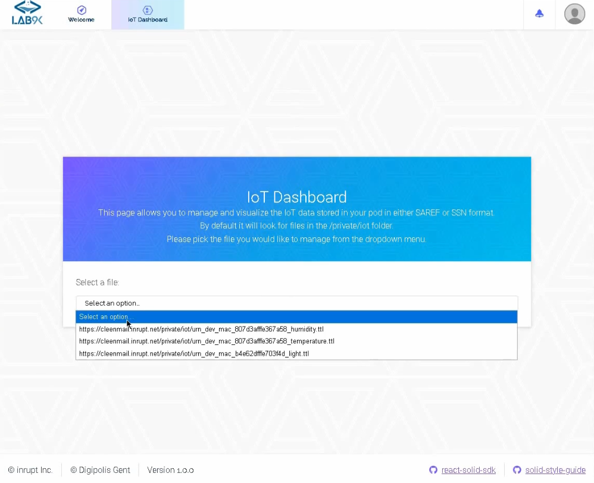
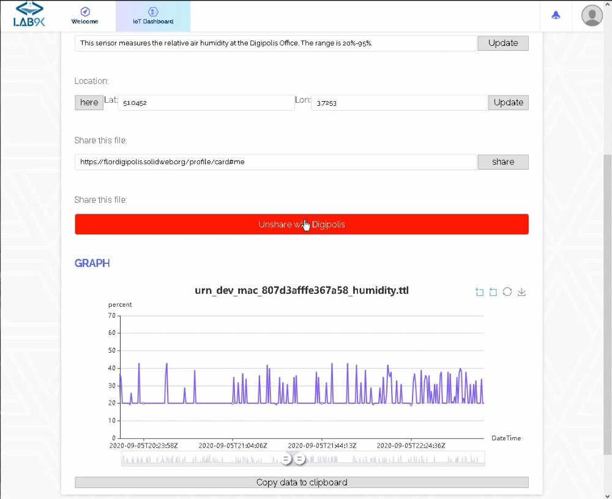

# IoT Dashboard

## Installation

- Install [node.js](https://nodejs.org/en/).
- Open a terminal in the `RMLMapper` folder and run `npm install` to install the dependencies.
  A list of the used packages can be found in `package.json` under `"dependencies"`.
- At the time of writing, one of the packages (`solid-file-client`) requires an additional installation step described [here](https://github.com/jeff-zucker/solid-file-client/blob/master/README.md#installing).

## Usage

### To use the application in a development/test environment:

- Start the program with `npm start`.
- Open [http://localhost:3000](http://localhost:3000) to view the webpage in your browser.
- Go to the IoT Dashboard tab, the application will look for files in the `/private/iot/` folder on the storage part of your Solid Pod.
  The dashboard should look like this:
  
- Select one of the available files, if it contains valid data it will be visualized in an interactive graph.
  Options are available to share the data and edit some of it as well as copy the sensor measurements to clipboard in JSON format.
  Example:
  

### Other available scripts

- `npm run build`: Builds the react app for production in the `build` folder. The app can then be deployed.
- `npm run eject`: Copies all the configuration files into the project for full control over them. In principle you don't ever have to use eject.
  Note: This is a one-way operation!

## React: Learn more.

Note: This project was bootstrapped with Solid [React Application Generator](https://github.com/inrupt/generator-solid-react)  based on [Create React App](https://github.com/facebook/create-react-app).

You can learn more in the [Create React App documentation](https://facebook.github.io/create-react-app/docs/getting-started).

To learn React, check out the [React documentation](https://reactjs.org/).

### Code Splitting

This section has moved here: https://facebook.github.io/create-react-app/docs/code-splitting

### Analyzing the Bundle Size

This section has moved here: https://facebook.github.io/create-react-app/docs/analyzing-the-bundle-size

### Making a Progressive Web App

This section has moved here: https://facebook.github.io/create-react-app/docs/making-a-progressive-web-app

### Advanced Configuration

This section has moved here: https://facebook.github.io/create-react-app/docs/advanced-configuration

### Deployment

This section has moved here: https://facebook.github.io/create-react-app/docs/deployment

### `npm run build` fails to minify

This section has moved here: https://facebook.github.io/create-react-app/docs/troubleshooting#npm-run-build-fails-to-minify
