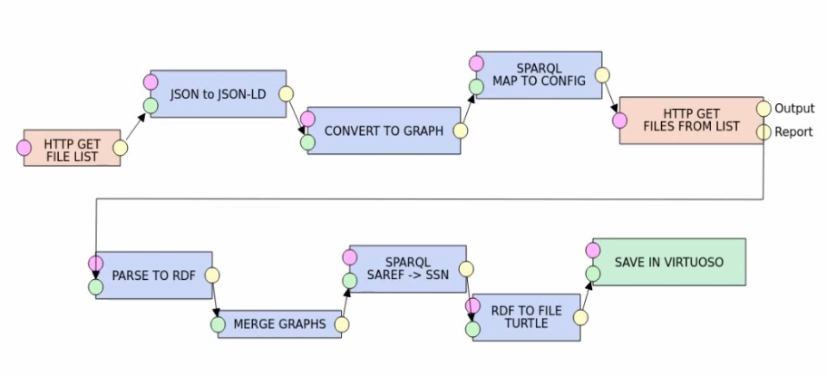

# Linked pipe

A pipeline set up in [LinkedPipes ETL](https://etl.linkedpipes.com/) which fetches the turtle files from containing IoT data from the [SolidIoT API](https://github.com/lab9k/Solid-Pods-For-IoT/tree/master/API), combines and transforms them and saves them in a [Virtuoso](https://virtuoso.openlinksw.com/) database.

## Installation

While LinkedPipes ETL can be built from the codebase, the easiest way of installation is through docker.

- Install [Docker](https://docs.docker.com/get-docker/).
- Install [Docker Compose](https://docs.docker.com/compose/install/).
- Install [LinkedPipes ETL](https://etl.linkedpipes.com/installation/). At the time of writing this could be done using this one-liner:
  `curl https://raw.githubusercontent.com/linkedpipes/etl/master/docker-compose.yml | docker-compose -f - up`
  If you want to run a locally available instance of [Virtuoso on Docker](https://github.com/tenforce/docker-virtuoso) for testing purposes you can download the `docker-compose.yml` file provided in this repository. Launch by running `docker-compose up` in the folder where this file is saved.
  Note: Add the `-d` flag to run the docker instance in the background.
- Open the GUI in the browser at `http://localhost:8080/#/pipelines` (default config).
- Click the hamburger button followed by the upload button.
  
- Upload the `config.json` file found in this repository.

## Usage

- Configure and start the SolidIoT API.
- Open the `Solid Datapod Combiner` pipeline in LinkedPipes ETL.
  The pipeline should look something like this:
  
- Several of the components in the Linked Pipe can (and should) be configured (double click on block with corresponding label):
  - **HTTP GET FILE LIST**: Change the `File URL` field to reflect where your instance of the SolidIoT API is hosted.
  - **SPARQL MAP TO CONFIG**: Change the URL on line 20 in the SPARQL CONSTRUCT query to reflect where your instance of the SolidAPI is hosted.
  - **HTTP GET FILES FROM LIST**: Enable or disable the Skip on error option as per the desired functionality.
  - **PARSE TO RDF**: Enable or disable the Skip on failure option as per the desired functionality.
  - **SPARQL SAREF->SSN**: This block can be bypassed if you don't want (partial) conversion from the Saref to the SSN ontology.
  - **SAVE IN VIRTUOSO**: All parameters used in this config are those of the default installation, adapt as needed.
- To run, press the EXECUTE button.
  
- The result is a merged triple store database in the configured Virtuoso system.
