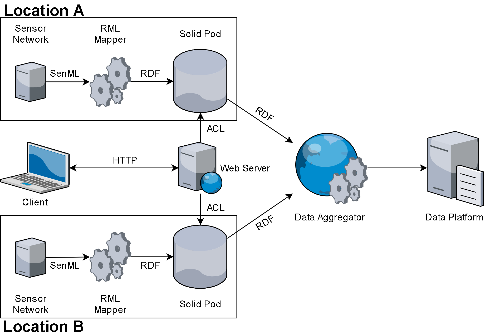

# Solid Pods For IoT

Code and documentation for the proof-of-concept (PoC) system to save real-time IoT data in [Solid](https://solidproject.org/) Pods and make use of an access control list (ACL) to make data aggregation over multiple Pods possible.

## Description

The PoC implementation is based on the network overview found below. Here, a short overview of the different components is given. Setup and implementation details are provided in the `README` of the corresponding subfolders.

- Sensor network: A small network of IoT sensors publishing real-time data in [SenML](https://tools.ietf.org/html/rfc8428) format over the [MQTT](http://docs.oasis-open.org/mqtt/mqtt/v3.1.1/os/mqtt-v3.1.1-os.html) protocol. The implementation is done in an Arduino environment for the [NodeMCU](https://www.nodemcu.com/index_en.html) development board.
- RML Mapper: A node.js server instance which connects to the the MQTT broker and converts the SenML data to [RDF](https://www.w3.org/RDF/) format by means of an [RML](https://rml.io/) mapper, after which the data is saved to a Solid Pod.
- Solid Pod: The place where the IoT data gets stored and shared. Either a Pod provider could be used or the Pod could be self-hosted.
- Web Server: Simple web application to manage access control for the documents where the IoT data is stored.
- Data aggregator: Application or API which fetches the IoT data from all Solid Pods it has access to and combines it for use in a data platform.
- Data Platform: Any data platform where the IoT data gets used.